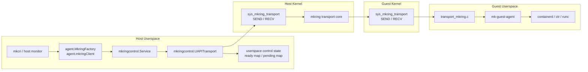
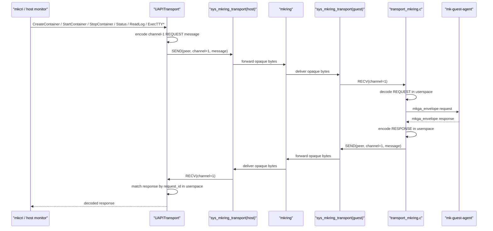
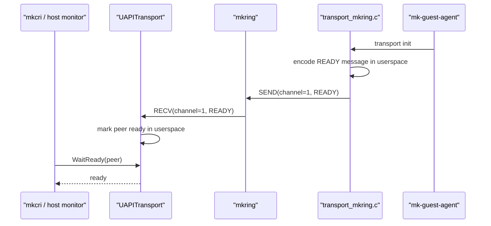

# Phase 2 Transport UAPI Diagram

This note captures the Phase 2 direction after narrowing the kernel boundary:

- keep `MKRING_CHANNEL_SYSTEM` reserved and unused for now
- remove `/dev/mkring_container_bridge`
- keep `/dev/mkring_stream_bridge` unchanged
- let the kernel provide only generic transport semantics
- keep message validity, ready handling, and request/response matching in userspace

## 1. Target Relationship



## 2. Container Control Flow



## 3. Ready Flow



Snapshot still keeps a userspace-only shortcut:

- host may mark a peer ready locally before a READY message arrives
- the kernel is not responsible for snapshot-specific ready state

## 4. Kernel Boundary

The kernel-side transport UAPI should do only this:

- validate the basic `mkring` transport header
- validate the destination peer and supported channel
- queue opaque messages by channel
- block in `RECV` until a message is available or timeout expires
- forward opaque bytes through `mkring_send()`

The kernel should not do this:

- interpret container operations
- validate container payload shapes
- maintain per-peer ready state
- match request/response ids
- know what `CREATE`, `STOP`, or `EXEC_TTY_*` mean

## 5. Phase 2 Runtime Path

After cutover, the control path becomes:

```text
mkcri
  -> mkringcontrol.UAPITransport
  -> sys_mkring_transport (host SEND/RECV)
  -> mkring
  -> sys_mkring_transport (guest SEND/RECV)
  -> transport_mkring.c
  -> mk-guest-agent
```

The stream path stays unchanged in Phase 2:

```text
mkcri streaming
  -> /dev/mkring_stream_bridge
  -> mkring channel 3
  -> guest PTY/session path
```

## 6. File Mapping

Kernel-side:

- [mkring_transport_uapi.h](/Users/yezhucan/Desktop/mk%20container/mkring/mkring_transport_uapi.h)
  - generic direct-entry transport UAPI
- [mkring_transport_syscall.c](/Users/yezhucan/Desktop/mk%20container/mkring/mkring_transport_syscall.c)
  - staging implementation of `sys_mkring_transport`
  - channel queueing and send/recv dispatch only

Host-side:

- [uapi.go](/Users/yezhucan/Desktop/mk%20container/mk-container/pkg/transport/mkringcontrol/uapi.go)
  - userspace ready tracking and pending-response matching
- [uapi_syscall.go](/Users/yezhucan/Desktop/mk%20container/mk-container/pkg/transport/mkringcontrol/uapi_syscall.go)
  - syscall-backed `SEND` / `RECV`

Guest-side:

- [transport_mkring.c](/Users/yezhucan/Desktop/mk%20container/mk-guest-agent/src/transport_mkring.c)
  - userspace READY publication
  - userspace REQUEST decode / RESPONSE encode

## 7. What Still Belongs To Phase 3

Phase 2 does not touch:

- `/dev/mkring_stream_bridge`
- stream session/data plane behavior
- SPDY/remotecommand host front-end
